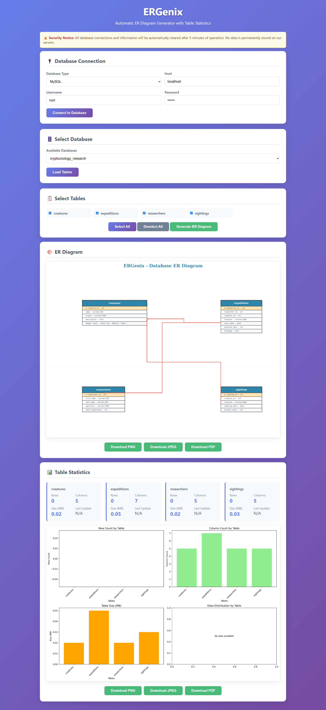

<h1 align="center">ERGenix - Auto ER Diagram Generator</h1>
<p align="center">
  
</p>

A modern Python-based tool to **auto-generate ER diagrams** and **table statistics** from MySQL, PostgreSQL, and SQLite databases. Packed with visual insights, responsive UI, and smart cleanup logic.

---

## 🚀 Setup Instructions

### 1. Create the project directory:
```bash
mkdir ergenix
cd ergenix
````

### 2. Create and activate virtual environment:

```bash
python -m venv venv

# On Windows:
venv\Scripts\activate

# On Linux/Mac:
source venv/bin/activate
```

### 3. Install dependencies:

```bash
pip install -r requirements.txt
```

### 4. Create folder structure:

```bash
mkdir templates static static/css static/js static/downloads
```

### 5. Save HTML:

Put your HTML inside `templates/index.html`.

### 6. Run the application:

```bash
python app.py
```

### 7. Visit in your browser:

```
http://localhost:5000
```

---

## ✨ Features

* ✅ Connect to MySQL, PostgreSQL, SQLite databases
* ✅ Auto-discover databases and tables
* ✅ Generate ER diagrams with relationships
* ✅ Table statistics and visualizations
* ✅ Download diagrams as PNG, JPEG, PDF
* ✅ Security: Auto-cleanup after 5 minutes
* ✅ Responsive design for mobile devices
* ✅ Real-time connection status
* ✅ Beautiful modern UI with animations

---

## 🗃️ Supported Databases

| Database   | Support Level               |
| ---------- | --------------------------- |
| MySQL      | ⭐ Recommended               |
| PostgreSQL | ✅ Full support              |
| SQLite     | ⚠️ Basic file-based support |

---

## 🔐 Security Features

* No data persistence
* Auto cleanup of idle connections every 5 mins
* No sensitive data stored on server
* Input validation and safe error handling

---

## 👨‍💻 How to Use

1. Enter database credentials
2. Select your database
3. Choose the tables for diagram
4. Click **Generate ER Diagram**
5. View diagram & stats
6. Download the result as PNG / JPEG / PDF

---

## 🌐 Browser Compatibility

| Browser | Status      |
| ------- | ----------- |
| Chrome  | ✅ Best      |
| Firefox | ✅ Supported |
| Safari  | ✅ Supported |
| Edge    | ✅ Supported |

---

## 🛠️ Troubleshooting

### 🔌 Connection Issues:

* Make sure DB server is running
* Check credentials
* Disable firewalls blocking connection
* Test with DB client tool first

### 🐢 Performance:

* For large DBs, limit number of tables selected
* Stats generation depends on table size

### 🧠 Memory:

* Uses matplotlib (can be heavy)
* Restart app if running into memory errors

---

## 🧩 Customization Tips

* Modify `templates/index.html` to change UI
* Add new DB drivers in `app.py`
* Enhance visualizations in `ERDiagramGenerator`
* Add new stats in `DatabaseManager`

---

## 🚀 Deployment Notes

### Production Setup:

1. Replace Flask dev server with Gunicorn
2. Set up Nginx reverse proxy
3. Add environment variables for config
4. Implement DB connection pooling
5. Use SSL for security

### Sample Production Command:

```bash
gunicorn -w 4 -b 0.0.0.0:5000 app:app
```

## ⚠️ Notes

* This setup is intended for **development**
* Add authentication for public deployment
* Consider using Redis for session management
* Add detailed logging for debugging
* Rate-limit API calls in production


## License

This project is licensed under the [MIT License](./LICENSE).  
© 2025 Chirag Gupta. Please credit if reused.


